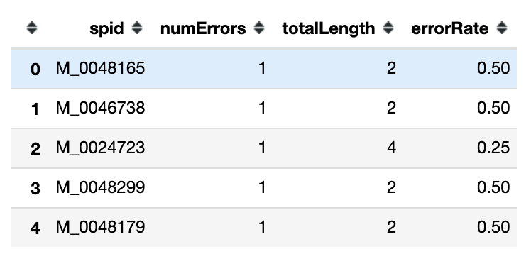

The crux of the problem has been explained in the main [Github ReadMe](https://github.com/yenniejun/JoseonMunkwa).

# The Problem: Disambiguation of Sillok Figures
When the Sillok was digitized and transcribed, the translators manually tagged the people in the text. Each line in the sillok has a `sid` (sillok id) and each person has a unique `spid` (sillok person id). While the translators endeavored to ensure that all unique people were grouped by their respective `spid`s, due to inconsistent tagging and translation, some of the `spid`s include more than one person, and some of the unique people have more than one `spid`. This can be due to reasons such as the person having different name spellings, different nicknames, name mispellings, typos, or just plain mistakes. 

In order to address this issue, the first step towards disambiguation I tackle is the case in which for one `spid`, there are multiple people included, and we must split that `spid` into the correct number of distinct, unique people.

## Steps to Split

### 1. Create `entries_iqr`: 
First, make a list of each year that a person is mentioned in the Sillok. That is, make a mapping from each unique `spid` to `rdate` (year). Remove those entries that only mention each person once.  

Then, find the IQR for each entry

### 2. Generate `to_split`:
For each `spid` person, sort each of their entries in the Sillok with `rdate` increasing. If this person is truly one person, then their `level` should decrease: as you get promoted, your `level` decreases, with 1 being the highest level. 

`    spid_person = spid_person.sort_values(['rdate','level'], ascending=[True, False])`

There are exceptions, of course. There are many cases of people being referenced after they are dead, in which case it could be the same person many years after they died, in which the level order could be rather volatile.

Therefore, we count the number of `level` descending ERRORS and calculate an `errorRate` (number of errors / the number of references) for each `spid`

There are 8086 people in `to_split`, but we must be wary of how many have the `errorRate` of 50%, because there are 460 cases of the person having 2 mentions but 1 error ... We must keep cases like this (where `n` is low) in mind.

We can plot `errorRate` in a histogram as below:

As mentioned before, there is a spike in 0.5 because of the "2 mentions 1 error" case, but otherwise, the majority of the errors are beneath 0.3 We can interpret this as a 30% error.

### 3. Generate `unique_names_for_spid`
Taking a slightly different approach. For each `spid` in `to_split`, I follow each reference of this `spid` in each `sid` in the orignal Sillok text. This involves parsing the original Sillok XML text (using elementTree) in order to find the name inscribed in the XML. Then, for each `spid`, I construct a set of names that are mentioned in the Sillok text associated with the `spid`. The hope is to detect errors in the tagging (i.e. two different people in reality tagged with the same `spid`).

Here, `names` are the set of names that occur in the Sillok, and `unique_names` are the names that are distinct. Unique names are determined by the following criteria:

1. There are three types of names: full name (ex: '李繼長'), first name ('繼長'), and alias (like a nickname)
2. In a given record, an alias will not show up on its own. That is, a full name or first name will always occur with an alias. 
3. Full names and first names are assumed to be the same person and therefore merged in `unique_names`

### 4. `split_people`
Using `unique_names_for_spid`

For each `spid` and `sid` pair in `to_split`, determine the "official name", which can be found in `sillok_person.csv`

Compare the `unique_names` in `unique_names_for_spid` with the "official name". If the "official name" appears in the list of `unique_names`, this means that this record does indeed reference the "official name" (because if the name is an alias, it will always occur in tandem with a full name). If the name does not equal the full name or the first name, then it is a wrong name, and goes inside `split_people`. For those distinct "split people", I generate a new temporary `spid`, which is the same as the old spid, except starting with a `T` instead of with an `M`.

We have also calculated an `alpha` value - this takes the average of the `new_years` (the years associated with the split person's name) and the averag of the `old_years` (the years associated with the official name) and finds the difference. The bigger the `alpha`, the more distinct the two sets of years. A histogram of the alphas look like this. We could make the hypothesis that smaller alphas yield typos or misspellings (i.e. the two sets of years are very close and overlap) and that larger alphas may actually yield two distinct people grouped under the same ID.

Here are the split people with the top alpha values. As you can see, there are several cases where people with similar names were grouped together even though they were different people. Example: '金思䄷' and '金思' are different people, but they were tagged with the same `spid`.	

We can also draw a scatterplot of these two groupings of years to see how distinct they are.
Here is an excerpt; the full PDF can be found [here](https://github.com/yenniejun/JoseonMunkwa/blob/master/img/split_people_years.pdf) or under'img/split_people_years.pdf'.

We can see three different cases:

1. Perhaps one misspelling, stuck in the middle of a lot of other records ... Could be a different person but is more likely that it is a misspelling

2. Two distinct groups. Very likely that this is two different people

3. Unclear. The two spellings of names are interweaved. Will need closer looking

# Appendix
term | meaning
-----|-----
`sid`| sillok id  
`spid`| sillok person id: For each 
`rdate`| date in the sillok. This number can be translated to either lunar or solar date using `data/reference/dates.csv` 
`level` | the `gwanjik` level. This can be referenced in `data/references/gwanjik.csv`

